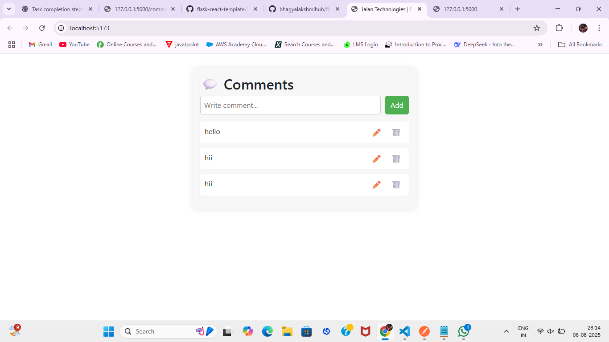

# 🧠 Flask + React Comments App

A full-stack web application that allows users to **add, view, update, and delete comments** using a **React frontend** and **Flask backend**.

This project was built as part of an **Associate Software Engineer Internship Assessment** (Python + React).

---

## 🚀 Features

✅ Add, Edit, Delete Comments  
✅ Fetch comments from SQLite database  
✅ React frontend with Axios API calls  
✅ Flask RESTful API with CRUD support  
✅ Automated tests using Pytest + unittest  
✅ CORS enabled  
✅ Clean & minimal UI using Vite + TypeScript

---

## 🛠️ Tech Stack

**Frontend:**
- React
- TypeScript
- Axios
- Vite

**Backend:**
- Python
- Flask
- SQLAlchemy
- SQLite
- Flask-CORS

**Testing:**
- Pytest
- Unittest

---

## 📁 Project Structure

flask-react-template/
├── README.md
├── src/
│ ├── apps/
│ │ ├── backend/
│ │ │ ├── main.py
│ │ │ ├── models/
│ │ │ ├── test_app.py
│ │ │ └── requirements.txt
│ │ └── frontend/
│ │ ├── src/
│ │ │ ├── index.tsx
│ │ │ └── components/
│ │ │ └── Comments.tsx
│ │ └── vite.config.ts


---

## ⚙️ Setup Instructions

### ✅ 1. Backend (Flask)

```bash
cd src/apps/backend
python -m venv venv
venv\Scripts\activate  # On Windows
pip install -r requirements.txt
python main.py

This runs your backend on http://localhost:5000

cd src/apps/frontend
npm install
npx vite

This runs the frontend on http://localhost:5173

Running Backend Tests : Running Backend Tests

GET	-	Get all comments
POST	-	Add a new comment
PUT	-	Update comment
DELETE	-	Delete comment

UI Screenshot


Loya Bhagya Lakshmi
B.Tech AI & DS, VVIT
GitHub: @bhagyalakshmihub


---

### ✅ Next Steps

1. Create `README.md` in your root folder.
2. Paste the above content.
3. Optional: Add a UI screenshot.
4. Push to GitHub (`git add .`, `git commit -m "add readme"`, `git push`).

Let me know if you want me to:
- Add a UI screenshot
- Help push to GitHub
- Polish README further

All the best! ✅
